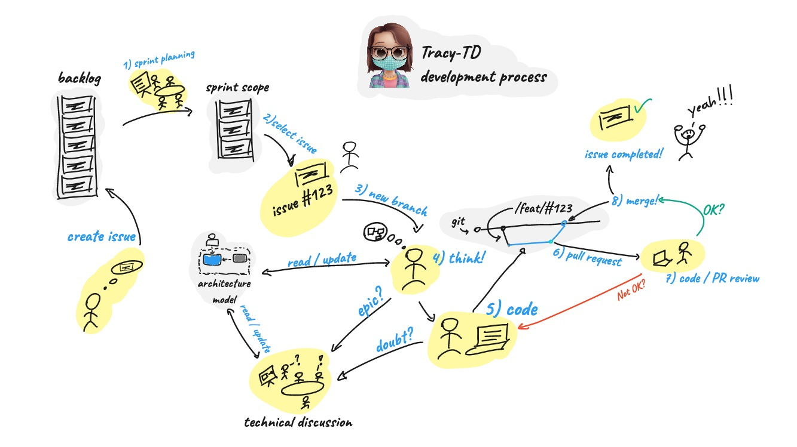

# Processo de Desenvolvimento

O processo de desenvolvimento do projeto Tracy-TD segue uma abordagem iterativa e colaborativa, permitindo que a equipe trabalhe de forma eficiente e eficaz. A seguir, descrevemos os passos envolvidos nesse processo:

1. Planejamento da Sprint: No início de cada sprint, a equipe realiza uma reunião de planejamento para definir as metas e prioridades da iteração. Durante essa reunião, as tarefas são discutidas e atribuídas aos membros da equipe.

2. Selecionar tarefa: Com base nas metas estabelecidas, cada membro da equipe seleciona uma tarefa para trabalhar. Essas tarefas estão registradas no sistema de gerenciamento de problemas, como o GitHub Issues, e são acompanhadas de descrições detalhadas.

3. Criar nova branch: Antes de iniciar o desenvolvimento da tarefa, é criada uma nova branch no repositório do projeto. Essa branch é usada para isolar as alterações relacionadas à tarefa específica e facilitar o controle de versão.

4. Pensar!: Antes de começar a codificar, é importante dedicar um tempo para analisar e planejar a abordagem a ser adotada. Nesse momento, a equipe realiza discussões técnicas e busca compreender a melhor forma de resolver o problema em questão.

5. Codificar!: Com o planejamento em mente, os desenvolvedores iniciam a codificação da solução. Eles seguem as melhores práticas de desenvolvimento de software e utilizam as ferramenta5. s e tecnologias adequadas ao projeto.

6. Pull Request: Após concluir o desenvolvimento da tarefa, é feito um Pull Request para integrar as alterações à branch principal do projeto. O Pull Request inclui uma descrição clara das alterações realizadas e pode ser revisado por outros membros da equipe.

7. Revisão de Código / PR: O Pull Request passa por um processo de revisão de código, no qual outros membros da equipe analisam o código, oferecem feedbacks e sugerem melhorias. Essa revisão ajuda a garantir a qualidade do código e a consistência com os padrões definidos.

8. Merge!: Após a revisão e aprovação do Pull Request, as alterações são mescladas à branch principal do projeto. Esse processo garante a incorporação das alterações e a atualização do código-fonte do projeto como um todo.

---
# Discussões Técnicas

Durante todo o processo de desenvolvimento, a equipe também realiza discussões técnicas e atualizações do modelo de arquitetura, buscando manter uma visão clara e atualizada da estrutura e componentes do Tracy-TD.

Esse processo iterativo permite uma evolução contínua do projeto, promovendo a entrega de valor aos usuários e a melhoria constante da qualidade do software.

---

O diagrama "Development Process" ilustra uma visão geral do processo de desenvolvimento adotado no projeto Tracy-TD. O processo é composto por etapas bem definidas, desde o planejamento das tarefas até a revisão e mesclagem do código. Cada etapa desempenha um papel importante no fluxo de trabalho da equipe, garantindo um desenvolvimento eficiente e de qualidade. Através desse processo, a equipe colabora de forma estruturada e organizada, resultando em entregas consistentes e alinhadas com as metas e objetivos do projeto Tracy-TD.

<!-- Development Process
The development process of the Tracy-TD project follows an iterative and collaborative approach, allowing the team to work efficiently and effectively. Below, we describe the steps involved in this process:

Sprint Planning: At the beginning of each sprint, the team holds a planning meeting to define the goals and priorities for the iteration. During this meeting, tasks are discussed and assigned to team members.

Select Task: Based on the established goals, each team member selects a task to work on. These tasks are recorded in the issue tracking system, such as GitHub Issues, and are accompanied by detailed descriptions.

Create New Branch: Before starting the task development, a new branch is created in the project repository. This branch is used to isolate the changes related to the specific task and facilitate version control.

Think!: Before diving into coding, it is important to take some time to analyze and plan the approach to be taken. At this stage, the team engages in technical discussions and seeks to understand the best way to solve the problem at hand.

Code!: With the planning in mind, developers begin coding the solution. They follow best software development practices and use appropriate tools and technologies for the project.

Pull Request: After completing the task development, a Pull Request is made to integrate the changes into the main branch of the project. The Pull Request includes a clear description of the changes made and can be reviewed by other team members.

Code/PR Review: The Pull Request goes through a code review process, where other team members review the code, provide feedback, and suggest improvements. This review helps ensure code quality and consistency with defined standards.

Merge!: Once the Pull Request has been reviewed and approved, the changes are merged into the main branch of the project. This process ensures the incorporation of the changes and updates the project's source code as a whole.

Technical Discussions
Throughout the development process, the team also engages in technical discussions and updates the architecture model, aiming to maintain a clear and up-to-date view of the Tracy-TD structure and components.

This iterative process allows for continuous project evolution, promoting the delivery of value to users and the constant improvement of software quality.

The "Development Process" diagram provides an overview of the development process adopted in the Tracy-TD project. The process consists of well-defined steps, from task planning to code review and merging. Each step plays an important role in the team's workflow, ensuring efficient and quality development. Through this process, the team collaborates in a structured and organized manner, resulting in consistent deliveries aligned with the goals and objectives of the Tracy-TD project.-!>